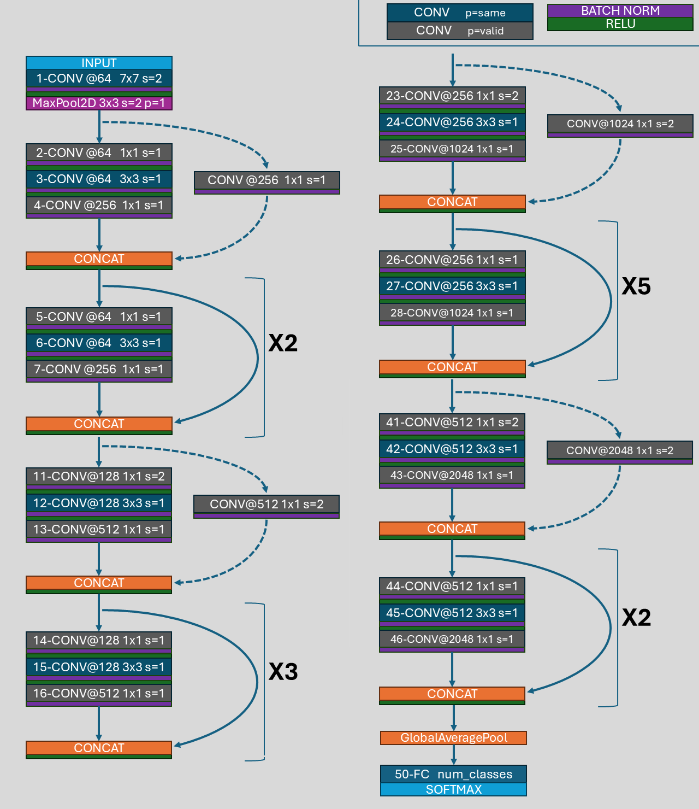

# p012-resnet-v1-v1_5-v2-models
This repo contains scripts that generate resnet models (v1, v1.5, v2) using both tensorflow and pytorch frameworks.
## Repo Files Info
In tensorflow, [tf_resnet.py](tf_resnet.py) contains 4 functions for the implementation of renets with any layers and versions. ResNet18, 34, 50 model generation functions have been made using 4 functions but you can easily make functions for resnet 101 or number of layers of your choice. \
Similarly in pytorch, [torch_resnet.py](torch_resnet.py) contains 3 classes from which you can make different layers and versions of ResNet. As a example, ResNet18, 34, 50 model generation functions are made using 3 classes. \
Testing and visualization of ResNet18, 34, 50 using scripts [tf_resnet.py](tf_resnet.py) and [torch_resnet.py](torch_resnet.py) is done in [tf_resnet_testing.ipynb](tf_resnet_testing.ipynb) and [torch_resnet_testing.py](torch_resnet_testing.py), resppectively.models

In folder [rough_work](/rough%20work/), resnet models and versions are created separately so that using common patterns among them, can make generic code scripts like tf_resnet.py and torch_resnet.py.
you can find some rough work and additional scripts.
## ResNet architectures detailed pictures
ResNet architectures with less than 50 layers (i.e. 18, 34) use basic residual building blocks; while 50 or more layers ResNets use bottleneck blocks. See below image for difference:

 

**Note**: v1.5 is not possible for less than 50 layers(ResNet18 and ResNet34). Also, v2 is possible for ResNet34 only and not for ResNet18.

For ResNet50 and above, a slight modification called v1.5 was trained by nvidia where middle convolution layer in bottleneck block cause height, width reduction by 2 instead of first convolutional layer of original resnet proposed. As you can see in above picture, bottleneck block has moiddle conv layer that halves the height, width via taking stride 2; hence it is bottleneck v1.5 to be exact.

To explore the difference between v1, v1.5, v2; take a look at below images of ResNet50 with respective order :

ResNet50v1

ResNet50v1.5

ResNet50v2

For ResNet with basic blocks(i.e. less than 50 layers), v1.5 is not applicable. So we have v1 and may be v2 if layers greater than 30.

ResNet34v1 vs v2

